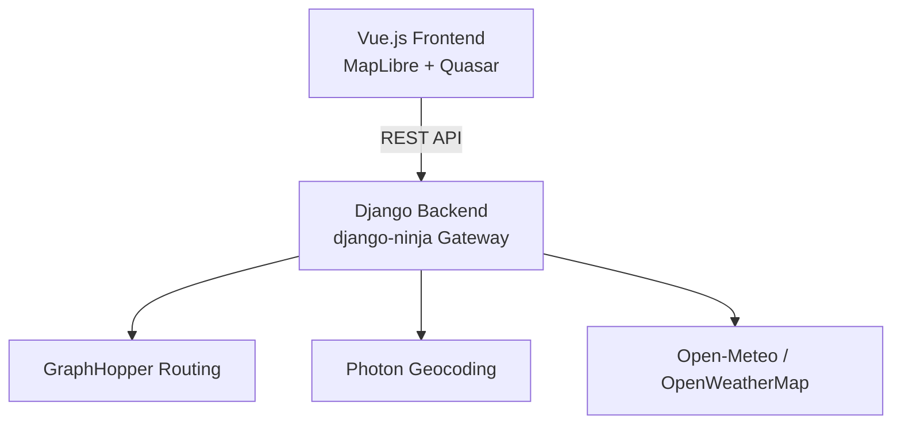

# NoRain – Wetterprognose entlang deiner Velo-Route

NoRain beantwortet die Frage, die eine punktuelle Wettervorhersage nicht kann: **Wird es
unterwegs regnen?** Für eine gegebene Route (z. B. Zihlschlacht → Frauenfeld, ~1 h) und eine
Abfahrtszeit berechnet die App, **wo du zu welcher Uhrzeit bist**, und schlägt für jeden Punkt
der Strecke die feingranulare Vorhersage nach – inklusive Niederschlag und **Wind (Stärke,
Richtung sowie Gegen-/Rückenwind relativ zur Fahrtrichtung)**.

## Funktionsweise

1. **Routing & Timing:** Eine selbst gehostete **GraphHopper**-Instanz routet Start → Ziel und
   liefert Geometrie *und* die Fahrzeit pro Segment. Daraus ergibt sich die Ankunftszeit an jedem
   Punkt der Strecke (`clock_time = Abfahrt + verstrichene Fahrzeit`).
2. **Sampling:** Die Route wird in festen Zeitabständen (Standard: alle 5 min) abgetastet – jeder
   Messpunkt hat damit Ort **und** Uhrzeit.
3. **Vorhersage:** Für jeden Messpunkt wird die Vorhersage nachgeschlagen – primär über
   **Open-Meteo `minutely_15`** (15-Minuten-Auflösung, Niederschlag *und* Wind, mehrere Tage,
   kostenlos und ohne Key), mit **OpenWeatherMap One Call 3.0** als Fallback/Gegencheck.
4. **Wind:** Aus der lokalen Fahrtrichtung und der Windrichtung werden Gegen-, Rücken- und
   Seitenwind berechnet.

## Architektur



- **Backend:** Django + **django-ninja** (async ASGI). Endpunkte: `/api/search` (Geocoding via
  Photon), `/api/route_weather` (Routing + Wetter). Keine Datenbank-Modelle – Django nutzt nur
  lokales SQLite für die eingebauten Apps.
- **Frontend:** Vue 3 SPA, **MapLibre GL** für die Karte, **Quasar** für UI, **TanStack Query**.
  Der TypeScript-Client wird aus dem OpenAPI-Schema des Backends generiert.
- **Geodienste:** Selbst gehostetes **GraphHopper** (Routing) und **Photon** (Geocoding).

## Abdeckung / OSM-Extrakt

Die Abdeckung entspricht dem geladenen **OSM-Extrakt**. Standard ist die Schweiz; für eine andere
Region in `.env` setzen:

- `OSM_DATA_URL` – beliebiges Geofabrik-`.osm.pbf` (Land / Kontinent / Planet) für GraphHopper.
- `PHOTON_INDEX_URL` – passende Photon-Daten von https://download1.graphhopper.com/public/
  (Versions-Token muss `1.0` sein, passend zum `photon-1.0.1.jar`). Zwei Varianten:
  - Land/Region: `…/photon-dump-<region>-1.0-latest.jsonl.zst` – wird beim ersten Start importiert
    (dauert wenige Minuten); Standard ist Schweiz+Liechtenstein (~248 MB).
  - Kontinent/Planet: `…/photon-db-<region>-1.0-latest.tar.bz2` – vorgefertigter Index (nur entpackt).
- `PHOTON_IMPORT_HEAP` – JVM-Heap für den Import-Schritt (Standard `4g`; für grössere Regionen erhöhen).
- `GRAPHHOPPER_HEAP` – JVM-Heap; für grössere Extrakte erhöhen (z. B. `16g`).

Punkte ausserhalb des geladenen Extrakts können nicht geroutet/geocodiert werden.

## Setup

```bash
cp .env.template .env   # OPENWEATHERMAP_API_KEY (optional) und ggf. OSM_DATA_URL / PHOTON_INDEX_URL setzen
docker compose up -d    # GraphHopper + Photon (erster Start lädt den OSM-Extrakt/Index)

# Backend
cd backend && uv sync && .venv/Scripts/python manage.py migrate && .venv/Scripts/python manage.py runserver

# Frontend
cd frontend && npm install && npm run dev   # http://localhost:3000
```

Nach Backend-Schema-Änderungen den API-Client neu generieren: `cd frontend && npm run update:api`.
