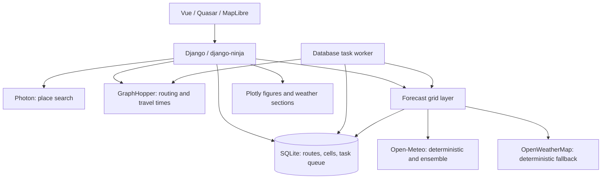

# Architecture and data lifecycle

A point forecast describes weather at one location. A route forecast needs the
weather at several locations at the times a traveler reaches them. NoRain separates
journey geometry from weather data so recurring trips can reuse both independently.

## Geometry determines the sample times

GraphHopper supplies a polyline and per-segment travel times. NoRain distributes
each time interval across its subsegments by geographic length, accumulates elapsed
time at every vertex, and chooses vertices nearest regular time targets. The final
vertex is included and duplicate sample indices are removed.

The default target spacing is five minutes. This is a sampling interval along the
journey, independent of a weather provider's forecast resolution. Arrival time is
computed as departure plus estimated elapsed riding time. There is no live rider
tracking or measured-speed correction.

An ad-hoc request calculates geometry in the request flow. Creating a recurring
route stores its inputs immediately and queues geometry computation. The worker
persists the polyline, duration, distance, and sample points, allowing later forecast
requests to skip routing. Coordinate or profile changes invalidate that geometry;
schedule-only changes reuse it.

## Weather is shared spatially

[ForecastCell and EnsembleCell](../../backend/core/models.py) store raw time-series
responses rather than final per-route results. Coordinates rounded to two decimals
form an approximate kilometre-scale grid; its physical width and area vary with
latitude. Nearby route samples therefore share provider data.

Deterministic uniqueness is `(lat_r, lon_r, day_key, source)`; ensemble uniqueness
is `(lat_r, lon_r, day_key)`. Although model help text describes `day_key` as the
fetch date, current request and pre-warm callers pass the departure date. Routes
share cells when these keys match.

A database cell is reusable when it is at most two hours old and its stored
`forecast_days` covers the caller's requested horizon. Otherwise the grid layer
fetches and updates the row. Expiration rejects data on lookup; it does not delete
old rows, and no periodic pruning command is provided.

Deterministic lookup checks fresh Open-Meteo and then fresh OWM cache entries
before fetching. With neither available, it fetches Open-Meteo and falls back to
OWM on a handled fetch failure. Without an OWM key, that fallback cannot supply
data. Ensemble failures leave probability optional; deterministic weather can
still be used.

The ensemble fetcher also has a process-local LRU cache without a time-based TTL.
A database refresh may therefore reuse a response already in that process's memory.
The two-hour database policy is not a guarantee of a new upstream ensemble fetch.
Routing and geocoding also have bounded process-local LRU caches.

## Background work reduces request latency

Django's database task backend holds geometry and weather-refresh jobs in SQLite.
`db_worker` processes them separately from HTTP requests. An external scheduler can
run `refresh_forecasts` to enqueue cells for the next three departures of each active
route with geometry. No scheduler is automatically installed.

Weather requests fetch unusable or missing cells themselves, so forecast pre-warming
is optional. The current pre-warm scan has an async/synchronous ORM mismatch noted
in [troubleshooting](../how-to/troubleshooting.md).

## Code map

| Module | Responsibility |
| --- | --- |
| `backend/core/api.py` | Router registration and Photon search |
| `backend/core/weather.py` | Routing, sampling, arrival times, wind, summary |
| `backend/core/grid.py` | Provider fetching, cache lookup, source-aware extraction |
| `backend/core/models.py` | Recurring routes and weather-cell persistence |
| `backend/core/schedule.py` | Cron departures and forecast window |
| `backend/core/tasks.py` | Geometry computation and forecast pre-warming |
| `backend/core/routes_api.py` | Saved-route CRUD and forecast assembly |
| `backend/core/plotting.py`, `sections.py` | Plotly figures and condition groups |
| `frontend/src/pages/`, `components/` | Route UI, maps, summaries, charts |
| `packages/api/` | Shared generated TypeScript API client |

[Documentation index](../README.md)
