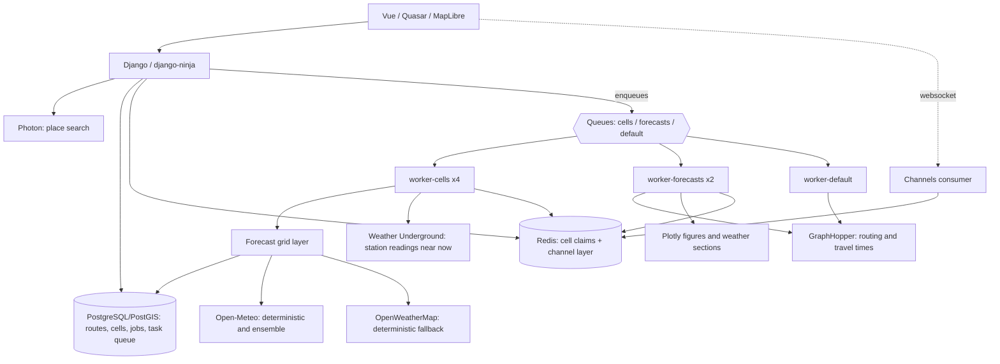

# Architecture and data lifecycle

A point forecast describes weather at one location. A route forecast needs the
weather at several locations at the times a traveler reaches them. NoRain separates
journey geometry from weather data so recurring trips can reuse both independently.

## Geometry determines the sample times

GraphHopper supplies a polyline and per-segment travel times. NoRain distributes
each time interval across its subsegments by geographic length, accumulates elapsed
time at every vertex, and chooses vertices nearest regular time targets. The final
vertex is included and duplicate sample indices are removed.

The default target spacing is five minutes. This is a sampling interval along the
journey, independent of a weather provider's forecast resolution. Arrival time is
computed as departure plus estimated elapsed riding time. There is no live rider
tracking or measured-speed correction.

Both ad-hoc and saved-route forecasts calculate geometry on a worker. Creating a recurring
route stores its inputs immediately and queues geometry computation. The worker
persists the polyline, duration, distance, and sample points, allowing later forecast
requests to skip routing. Coordinate or profile changes invalidate that geometry;
schedule-only changes reuse it.

## Weather is shared spatially

[ForecastCell and EnsembleCell](../../backend/core/models.py) store raw time-series
responses rather than final per-route results. Coordinates rounded to two decimals
form an approximate kilometre-scale grid; its physical width and area vary with
latitude. Nearby route samples therefore share provider data.

Deterministic uniqueness is `(lat_r, lon_r, day_key, source)`; ensemble uniqueness
is `(lat_r, lon_r, day_key)`. Although model help text describes `day_key` as the
fetch date, current request and pre-warm callers pass the departure date. Routes
share cells when these keys match.

A database cell is reusable when it is at most two hours old and its stored
`forecast_days` covers the caller's requested horizon. Otherwise the grid layer
fetches and updates the row. Expiration rejects data on lookup; it does not delete
old rows, and no periodic pruning command is provided.

Deterministic lookup checks fresh Open-Meteo and then fresh OWM cache entries
before fetching. With neither available, it fetches Open-Meteo and falls back to
OWM on a handled fetch failure. Without an OWM key, that fallback cannot supply
data. Ensemble failures leave probability optional; deterministic weather can
still be used.

Routing and geocoding have bounded process-local LRU caches (`core/weather.py` and
`core/api/places.py`); the grid layer has none, so a database miss always means an upstream
fetch. What prevents duplicate fetches instead is an in-flight claim in Redis, taken before
a cell task is queued and released when it finishes — including when it fails, so a cell
both providers refused stays retryable.

## Weather stations correct the first hours

For Pro accounts, a ride that overlaps the next two hours is corrected with readings from
Weather Underground personal weather stations (`core/stations.py`). Stations only measure
the present, so the correction is the difference between what the stations read now and
what the model says for now, added to the model at each sample's time with a weight that
falls to zero two hours (temperature) or one hour (rain) from the reading.

- Temperature is shifted by the median of the stations within 5 km, after dropping any
  more than 3 °C from the median, clamped to ±5 °C.
- Rain is used as presence only: the share of stations measuring rain moves the rain
  probability. The model's rain amount stays.
- Wind is not corrected; station anemometers sit too low and sheltered.
- At least two stations are needed, readings must be under 30 minutes old, and stations
  flagged as possibly wrong are skipped.

Corrected samples carry `station_count` and the summary carries `station_corrected`, and the
UI says so.

The free station-owner key allows 1500 calls a day and 30 a minute. Station lists are cached
for 14 days, readings for 10 minutes, a job reads at most six stations, and every call passes
a counter in Redis that refuses calls past 1400 a day or 25 a minute. Unlike cell claims, the
counter fails closed: without Redis no call is made. Only the `refresh_station_observations`
task fetches; the hourly pre-warm scan never does, since readings are stale long before the
next scan. A finished job whose ride is near now is reused for only 10 minutes.

## Requests enqueue; workers compute

No HTTP request performs a provider fetch, a routing call or a Plotly render. A forecast
request creates a `ForecastJob` and returns a job id; `plan_forecast_job` resolves the
route geometry and fans out one task per distinct ~1 km² grid cell; the last cell to settle
hands the job to `assemble_forecast_job`, which builds the payload from cells that are warm
by then and stores it. Progress reaches the browser over a WebSocket, with polling as a
fallback.

The job stores the complete payload but sends the browser a slim view of it: a route line
simplified to about 50 m, felt-wind arrows about 2 km apart instead of up to 500 wind
segments, and no chart figures or per-model ensemble breakdown. Those parts
are fetched from their own endpoints by the components that show them — the charts on the
route page, a finer line and denser wind arrows once the map is zoomed in, the model table once the details panel
is opened. A long route's job message drops from about 260 KB to about 60 KB this way, and
the map page never downloads chart data at all.

The queues are split because the database task backend runs one task per worker process at
a time: `cells` carries the provider fan-out across several replicas, `forecasts` carries
planning and assembly (a person is waiting on those), and `default` carries geometry,
thumbnails, pre-warm scans and maintenance. Because several workers run in parallel, queue
order no longer implies completion order — work that must follow other work is sequenced by
an explicit counter on the job, or deferred with `run_after`.

Pre-warming decides how quickly a forecast appears rather than whether it is available: a
route whose cells are all cold still resolves, it just spends longer fetching. A job that
assembles no samples at all is reported as failed rather than as an empty forecast.

## Code map

### Wind geometry and integration

`core/geo.py` supplies spherical distance/bearing helpers. `core/wind.py` is pure geometry
and vector processing with no provider or Django dependency. `weather.py` first reads the
original deterministic/ensemble anchors, retaining missing slots, then computes a local
wind profile before constructing samples and extracting ensemble statistics.

Wind-from east/north vectors are interpolated between adjacent valid original anchors.
Each non-zero geometry edge is subdivided at most every 25 m and clipped at sample-support
boundaries. Headwind, absolute crosswind, apparent speed and angle buckets are evaluated
locally before aggregation. Mean vector magnitude cannot replace mean apparent speed.
Ensemble members project onto the same support directions before calculating quantiles;
members are still fetched at sample resolution only. Stored float vertex times travel from
GraphHopper through RecurringRoute and ForecastJob.geometry to assembly. Older geometry
uses marked sample-time interpolation, with null apparent values where timing is unusable.

At most 500 display chunks have their own midpoint values and coverage, while route totals
come from independent numerical pieces. Ground scoring keeps its existing curves; absent
wind produces an unknown score. Algorithm version and saved-route geometry revision enter
job identity to avoid reusing older calculations after a geometry backfill.

| Module | Responsibility |
| --- | --- |
| `backend/core/api/` | API router registration, endpoint modules, and schemas |
| `backend/core/weather.py` | Routing, sampling, arrival times, wind, summary |
| `backend/core/geo.py`, `wind.py` | Pure geometry, local wind projection/integration and exposure distribution |
| `backend/core/grid.py` | Provider fetching, cache lookup, source-aware extraction |
| `backend/core/models.py` | Recurring routes and weather-cell persistence |
| `backend/core/schedule.py` | Cron departures and forecast window |
| `backend/core/tasks.py` | Every heavy operation: geometry, cells, job planning and assembly, scans |
| `backend/core/jobs.py`, `claims.py` | Forecast-job lifecycle; in-flight cell claims |
| `backend/core/consumers.py`, `routing.py` | WebSocket delivery of job progress |
| `backend/core/api/recurring_route.py` | Saved-route CRUD and forecast assembly |
| `backend/backend/settings/` | Shared, development, and production Django settings |
| `backend/core/plotting.py`, `sections.py` | Plotly figures and condition groups |
| `frontend/src/pages/`, `components/` | Route UI, maps, summaries, charts |
| `frontend/src/queries/` | TanStack query keys, fetch hooks, mutations, and cache invalidation |
| `packages/api/` | Shared generated TypeScript API client |

[Documentation index](../README.md)
